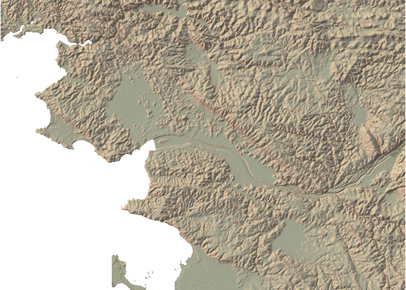
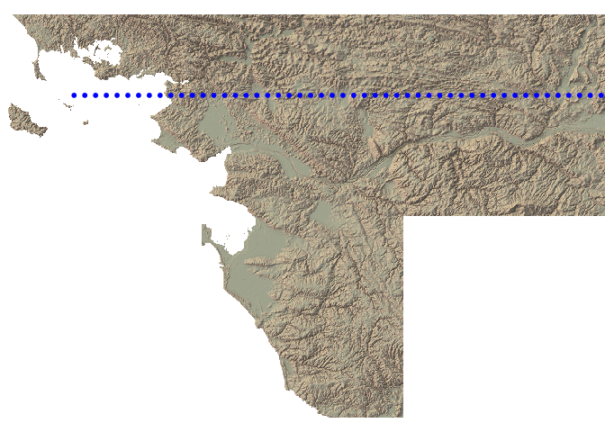
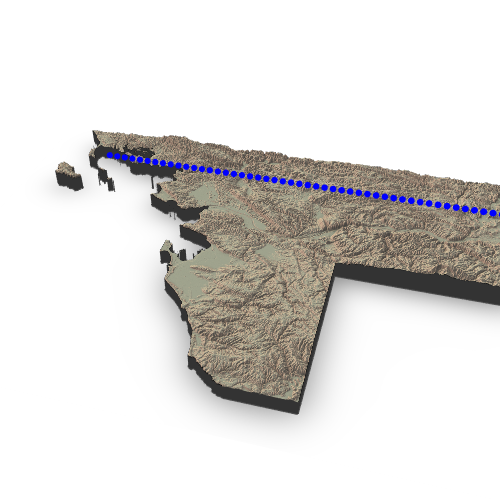

<!-- README.md is generated from README.Rmd. Please edit that file -->

# maps2ray

<!-- badges: start -->

<!-- badges: end -->

The goal of maps2ray is to transform spatial objects from {sf} and
{raster} to be used in {rayshader} 3D outputs.

## Installation

You can install the development version from
[GitHub](https://github.com/) with:

``` r
# install.packages("devtools")
devtools::install_github("statnmap/maps2ray")
```

## Example

This procedure is explained in a blog post at:
<https://statnmap.com/2019-10-06-follow-moving-particle-trajectory-on-raster-with-rayshader/>

``` r
library(maps2ray)
library(rayshader)
library(sf)
library(raster)
library(rasterVis)
library(ggplot2)
library(dplyr)
library(rgl)
```

  - Read internal raster file

<!-- end list -->

``` r
f <- system.file("extdata/Alti_mosaic_L93.tif", package = "maps2ray")
altitude <- raster(f)
```

  - Create a trajectory as {sf} object

<!-- end list -->

``` r
line_mat <- matrix(c(250000, 450000, 6720000, 6720000), ncol = 2)
line_traject <- st_linestring(x = line_mat)
point_traject <- st_sample(line_traject, size = 50, type = "regular") %>% 
  st_set_crs(2154) %>% 
  st_sf()

# Plot
gplot(altitude) +
  geom_tile(aes(fill = value)) +
  geom_sf(data = point_traject, colour = "white", inherit.aes = FALSE) +
  scale_fill_viridis_c()
```



  - Transform {sf} trajectory to {rayshader} coordinates reference
    system, relative to the `altitude` raster

<!-- end list -->

``` r
zscale <- 5
points_ray <- sf_proj_as_ray(r = altitude, sf = point_traject,
                             z_pos = maxValue(altitude) + 10,
                             zscale = zscale)
```

  - Create the {rayshader} terrain object to be used in both 2D and 3D
    outputs

<!-- end list -->

``` r
# Transform raster as matrix
datamat <- t(as.matrix(altitude))
# Rayshade raster
ambmat <- ambient_shade(datamat, zscale = zscale)
raymat <- ray_shade(datamat, zscale = zscale, lambert = TRUE)

# Create ray_image
ray_image <- datamat %>%
  sphere_shade(texture = "imhof4") %>%
  add_shadow(raymat, max_darken = 0.5) %>%
  add_shadow(ambmat, max_darken = 0.5) 
```

  - Plot rayshader image in 2D and add points with new coordinates
    reference system of {rayshader}: `sf` list in the output of
    `sf_proj_as_ray()`.

<!-- end list -->

``` r
# plot rayshader in 2D
plot_map(ray_image)
plot(points_ray$sf, col = "blue", pch = 20, add = TRUE, reset = FALSE)
```



  - Plot {rayshader} image in 3D and overlay points with the new
    coordinates reference system of {rayshader}: `coords` list in the
    output of `sf_proj_as_ray()`.

<!-- end list -->

``` r
# Create 3D scene
ray_image %>% 
  plot_3d(
    datamat,
    zscale = zscale, windowsize = c(500, 500),
    soliddepth = -max(datamat, na.rm = TRUE)/zscale,
    water = TRUE, wateralpha = 0,
    theta = 15, phi = 40,
    zoom = 0.6, 
    fov = 60)

# Add points over rayshader scene
spheres3d(
  bind_rows(points_ray$coords$coords),
  col = "blue", add = TRUE, radius = 10,
  alpha = 1)

# rgl::snapshot3d(file.path("img", "ray3dtotal.png"))
# rgl::rgl.close()
```


